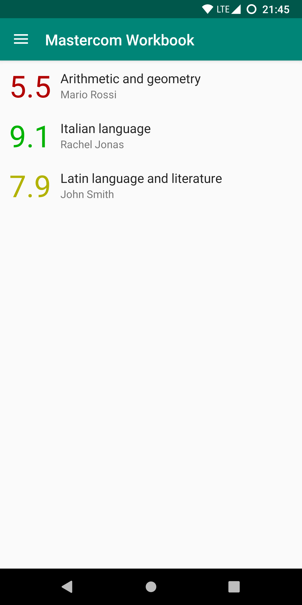
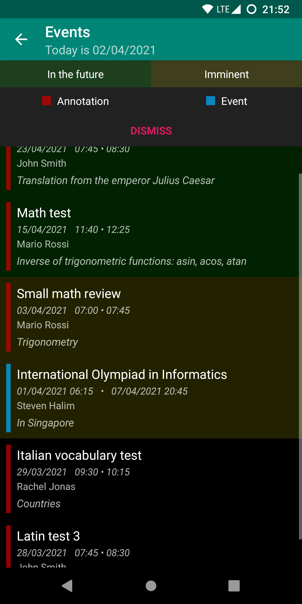

# Quadermas - Mastercom workbook client
[Mastercom](https://www.mastercompro.it/) is an italian company which provides services to schools (i.e. register-logs). One of these services is a website named "*Workbook*" (in italian "*Quaderno Elettronico*") made for **students to access marks, timetables, files**... This app is an Android client that **wraps around the website** and is able to show subjects, marks, topics, homework, timetables, events and documents. It is lightweight (`~5MB`) and uses Material Design.

*Note: only the student's credentials will work, the parents' ones won't*

The information shown in Quadermas comes from the same APIs of the official websites of schools' electronic workbooks, but Quadermas is not affiliated with "Mastercom", any school, the Italian government or other government entities.

    
    
    

# Features

## Login
- Log in with your **Workbook credentials** to any school that uses the Mastercom platform. Just insert the id of the school (e.g. `davinci-tn`), the user id (e.g. `123456`) and the password, and you are ready to go!
- The id of the school is the first part of the URL you would use to access the workbook online, as explained in the app. You will get a **popup list** with all of the schools that use Mastercom and you will be able to **search** through them.
- Log out is available, and school id and user id are **remembered**.

## Subjects
- Loads the **list of subjects** on startup and shows them in the home page, along with the corresponding teacher and marks' average.
- Calculate the **average by term** of the marks of a subject.
- Calculate **which mark you need** to get in the next `X` tests so that your average becomes `Y`. `X` and `Y` can both be chosen.

## Marks
- Every mark has a value, a description, a teacher and a date. Not-classified marks are supported (e.g. "A", or Absent).
- The `marks` view shows marks (from a subject, or all) in a list that can be **sorted by value and by date**.
- The `statistics` view shows a **graph of marks** (from a subject, or all). Clicking on a point in the graph shows the mark info.

## Topics & homework
- Every topic belongs to a subject and has a title, a date and possibly also a description and some assigned homework.
- The `topics` view shows topics (from a subject, or all) in a list, with a button that allows showing only topics with **homework** assigned.

## Timetable
- See the timetable for a **particular day**, selectable with dedicated buttons.
- Tap on a timetable event to add it to the **phone's calendar**.

## Events
- Every event has a title, a begin-end pair of dates/times and possibly also an organizer and a description.
- There can be two types of events: *annotations*, with a red **indicator**, and *events*, with a blue one. *Imminent* events and events *in the future* are **highlighted**, respectively, in yellow and green. A dismissable **legend** helps keep track of the meaning of the colors.
- Tap on an event to add it to the **phone's calendar**.

## Documents
- Find the documents you need thanks to **filters** (by **year** and by **subject**).
- **Download** a document by just tapping on it: an Android notification will show up. After the download has finished the notification can be clicked to view the downloaded document.

## Settings
- Choose the **theme** you prefer between *light*, *dark* and *black*.
- Setup the start date of the second term.
- Choose not to load marks directly.
