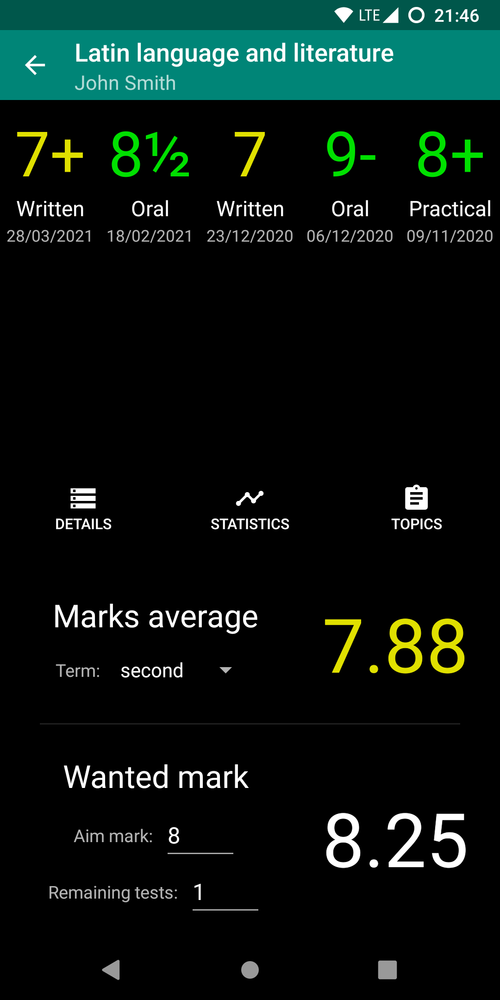
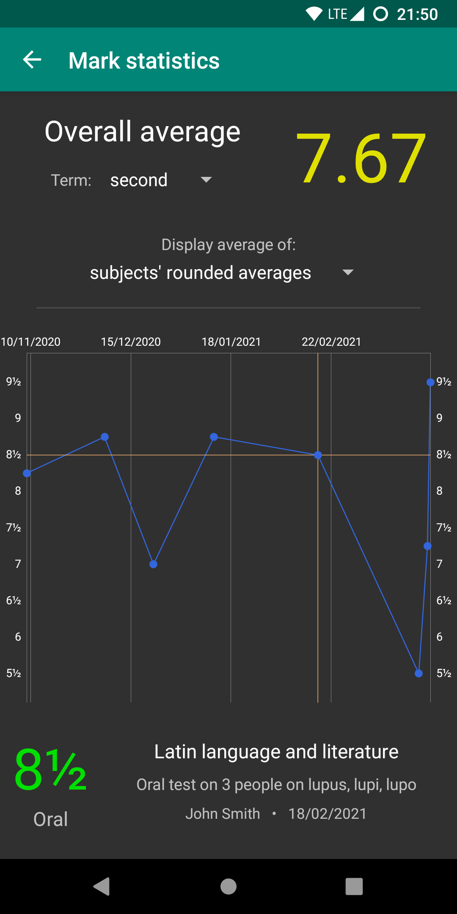

# Mastercom Workbook client
[Mastercom](https://www.mastercompro.it/) is an italian company which provides services to schools (i.e. register-logs). One of these services is a website named "*Workbook*" (in italian "*Quaderno Elettronico*") made for **students to access marks, timetables, files**... This app is an Android client that **wraps around the website** and is able to show subjects, marks, topics, homework, documents and timetables. It is lightweight (`~5MB`) and uses Material Design.

# Features

## Login
- Log in with your **Workbook credentials** to any school that uses the Mastercom platform. Just insert the id of the school (e.g. `marconi-tn`), the user id (e.g. `123456`) and the password, and you are ready to go!
- Log out is available, and school id and user id are **remembered**.

## Subjects
- Loads the **list of subjects** on startup and shows them in the home page, along with the corresponding teacher and marks' average.
- Calculate the **average by term** of the marks of a subject.
- Calculate **which mark you need** to get in the next `X` tests so that your average becomes `Y`. `X` and `Y` can both be chosen.

## Marks
- Every mark has a value, a description, a teacher and a date. Not-classified marks are supported (e.g. "A", or Absent).
- The `marks` view shows marks (from a subject, or all) in a list that can be **sorted by value and by date**.
- The `statistics` view shows a **graph of marks** (from a subject, or all). Clicking on a point in the graph shows the mark info.

## Topics & homework
- Every topic belongs to a subject and has a title, a date and possibly also a description and some assigned homework.
- The `topics` view shows topics (from a subject, or all) in a list, with a button that allows showing only topics with **homework** assigned.

## Documents
- Find the documents you need thanks to **filters** (by **year** and by **subject**).
- **Download** a document by just tapping on it: an Android notification will show up. After the download has finished the notification can be clicked to view the downloaded document.

## Timetable
- See the timetable for a **particular day**, selectable with dedicated buttons.
